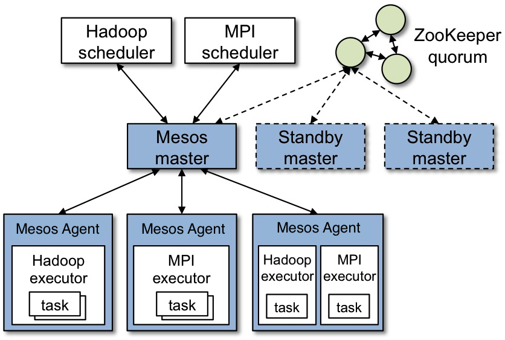
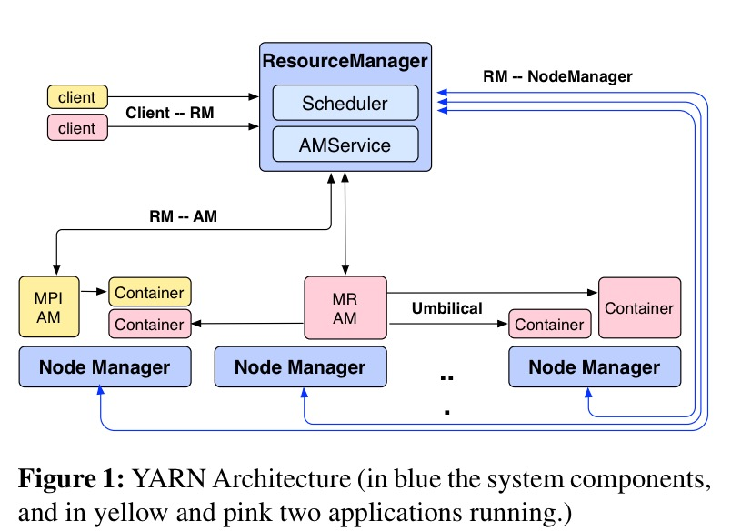
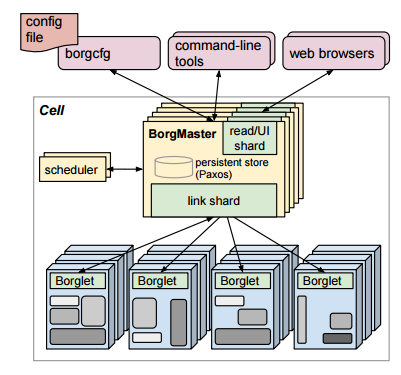
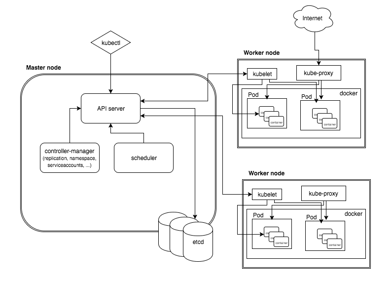

# Resource Management
Lo *strato di Resource Management* è responsabile della gestione delle risorse di un singolo cluster condiviso da più framework.
Eseguire ogni framework su un cluster dedicato sarebbe infatti costoso e renderebbe difficile la condivisione dei dati.

Un **cluster manager** è un middleware per la condivisione delle risorse di un cluster tra più framework secondo specifiche *policy di resource management*.
Il middleware rende trasparente il cluster ai framework, astraendolo come un pool di risorse computazionali.
Un **container orchestrator** è un cluster manager per applicazioni multi-container in ambiente Cloud.

Gli obiettivi del resource management sono: *massimizzazione dell'utilizzo delle risorse, minimizzazione della latenza, massimizzazione della data-locality*.

## Partizionamento delle risorse
Le risorse di un cluster sono condivise dai framework (eseguiti su VM o container) secondo un modello di partizionamento delle risorse:

* **static partitioning:** le risorse sono assegnate staticamente ad ogni framework.
* **dynamic partitioning:** le risorse sono assegnate dinamicamente ad ogni framework, proporzionalmente alle necessità di carico.

Le tecnologie di resource management basate su dynamic partitioning realizzano il paradigma **Datacenter-as-a-Computer** teorizzato da D. Patterson, in cui:

* le risorse e i dati sono *condivisi* tra più framework.
* la complessità del cluster è *trasparente* alle applicazioni.
* il cluster è accessibile mediante una *API unificata*.

## Policy di resource management
Una **policy di resource management** definisce la *disciplina di assegnazione delle risorse condivise ai framework coinvolti*.

Una policy deve soddisfare i seguenti requisiti:

* **share guarantee:** ognuno degli *N* framework deve avere almeno *1/N* della risorsa, ammenochè la sua domanda non sia esplicitamente inferiore.
* **strategy proof:** ai framework non conviene mentire sulla propria domanda.

Le policy più importanti sono:

* **fair sharing:** se una risorsa è condivisa da *N* framework, allora assegna ad ogni framework *1/N* della risorsa.
* **max-min fairness:** se una risorsa è condivisa da *N* framework e *m<N* framework hanno bisogno di al più una frazione di risorsa, allora assegna a questi framework tale frazione ed equipartisce la risorsa restante tra gli altri *N-m* framework.
* **weighted max-min fairness:** se una risorsa è condivisa da *N* framework e ad ognuno di essi è associata una priorità, allora assegna ad ogni framework una frazione di risorsa direttamente proporzionale alla sua priorità.

Queste policy vanno bene se lo spazio delle risorse è unidimensionale.

Se lo spazio delle risorse è multidimensionale, è necessario definire altre policy, come:
* **dominant resource fairness (DRF):** se un vettore di risorse è condiviso da *N* framework, allora determina per ogni framework la *dominant resource*, ovvero la risorsa con domanda percentuale maggiore (i.e. *dominant share*), e assegna le risorse in modo da uguagliare le dominant share di ogni framework.
* **online DRF:** appena vi sono risorse libere e task da eseguire, presenta offerte di risorse ai framework con la minore dominant share.

Le policy di tipo DRF causano comunque un piccolo sotto-utilizzo delle risorse.

---

## Mesos
Mesos è un *cluster manager open source* sviluppato dalla Barkeley University e divenuto presto top-project della Apache Software Foundation.

Tra gli early adopters conta Twitter e AirBnb ed oggi è utilizzato dalle più importanti applicazioni al mondo.

Le caratteristiche principali sono:

* **architettura master-slave**:
  * **Mesos Master (MM):** eletto da una master pool mediante *Zookeeper*.
  * **Mesos Agent (MA):** eseguito su ogni nodo, gestisce gli FE sul proprio nodo secondo le indicazioni di MM.
  * **(Framework) Scheduler (FS):** si registra su MM per farsi offrire le risorse.
  * **(Framework) Executor (FE):** lanciato da MA per eseguire uno o più task sul proprio nodo.

* utilizza **Zookeeper** per:
  * sincronizzazione dei componenti
  * elezione del master mediante Paxos
  * condivisione del data tree mediante consistenza primary-backup
  * condivisione dello spazio di naming
  * atomic broadcast

* **scheduling offer-based a due livelli**:
  * ogni MA invia a MM le risorse disponibili; MM offre risorse agli FS secondo policy di resource allocation **DRF** con **spazio di risorse multidimensionale**; FS seleziona l'offerta di risorse da accettare e i task da eseguire con tali risorse; comunica la propria scelta al MM.
  * scala facilmente, ma è *sub-ottimo*. L'alternativa è lo *scheduling monolitico*, in cui un *global scheduler* ha una visione globale dei task da schedulare, determinando così uno scheduling ottimo. Gli svantaggi sono la complessità dello scheduler, la difficoltà a scalare e la necessità di refactoring quando si aggiunge un nuovo framework.
  * unità di scheduling è il **task**, il quale consiste di uno o più processi in esecuzione sullo stesso nodo.
  * ogni framework gestisce ed esegue uno o più **job**, ognuno dei quali è costituito da uno o più task.

* **fault-tolerance:** risolve i seguenti fallimenti
  * **task failure:** FE notifica lo MA; MA notifica MM; MM notifica FS; FS richiede a MM di rischedulare il task; MM richiede a MA di rilanciare il task; FE rilancia il task.
  * **slave failure:** MA si riavvia (essendo un servizio); MA si registra nuovamente su MM.
  * **host failure:** MM si accorge del fallimento; MM notifica FS; FS chiede a MM di rilanciare il task; MM chiede ad un altro MA di eseguire il task; MA chiede a FE di eseguire il task; FE lancia il task.
  * **master failure:** Zookeeper elegge un nuovo MM dalla Master Pool; Zookeeper notifica ogni MA e ogni FS del nuovo MA; ogni MA e ogni FS si registra sul nuovo MM.
  * **scheduler failure:** i relativi task in esecuzione non vengono interrotti; FS si riavvia (essendo un servizio); FS chiede a Zookeeper l'identità del MM; FS si registra su MM; FS si sincronizza con MM, ovvero si allinea ai propri task in esecuzione.

* **framework-agnostic:** può eseguire qualunque framework, ma il framework devono essere consapevole di essere in esecuzione su Mesos.

* supporta i maggiori framework per sistemi distribuiti.
* suporta lo scheduling dei container.
* supporta i maggiori provider IaaS.
* scalabilità su cluster di 10000 nodi.
* scritto in C++.

---

## YARN
YARN (Yet Another Resource Negotiator) è un *cluster manager open source* nato per lo *scheduling di job MapReduce* e successivamente reso *general-purpose*.

Le caratteristiche principali sono:

* **architettura master-slave:**
  * **Resource Manager (RM):** ogni cluster ha un RM (non replicato), il quale è responsabile dell'allocazione delle risorse in risposta alle richieste di job. RM ha una visione globale delle risorse del cluster. È composto da uno **Scheduler**, che stabilisce le risorse da allocare alle applicazioni, e da un **Application Manager**, il quale assegna le risorse secondo quanto indicato dallo Scheduler.
  * **Application Master (AM):** ogni applicazione ha un AM, eseguito all'interno di un container, il quale inoltra al RM le richieste di risorse per la relativa applicazione. Le richieste inoltrate sono *late-binding*, ovvero le risorse allocate non sono vincolate ad una specifica richiesta, ma in generale all'AM (questo perchè la causa della richiesta potrebbe non essere più valida al momento dell'allocazione delle risorse). AM è anche responsabile di monitorare lo stato dei propri container.
  * **Node Manager (NM):** ogni nodo ha un NM. Si registra sul RM, invia il proprio stato al RM, e riceve istruzioni dal RM. Aggiorna RM sulle proprie risorse. Responsabile del ciclo di vita dei container. Configura l'ambiente di esecuzione per i container secondo quanto specificato dai relativi *Container Launch Context (CLC)* che ne descrive i comandi da eseguire e l'ambiente di esecuzione. Responsabile della garbage collection e altri servizi ausiliari.

* **scheduling request-based monolitico**:
  * RM ha una visione globale dello scheduling.
  * gli AM richiedono risorse al RM, in termini di specifiche di container. RM assegna un container, il quale viene inizializzato con il CLC specificato per lanciare il job da AM.
  * discipline di scheduling built-in e custom.
  * spazio delle risorse bidimensionale (CPU, RAM).
  * ottimizzato per job Hadoop.

* scritto in Java.

---

## Borg
Borg è un *cluster manager closed source* sviluppato da Google.

Le caratteristiche principali sono:

* **cell-partitioning:** il cluster è partizionato in **celle**, ognuna delle quali raggruppa circa *10K nodi eterogenei*.

* **architettura master-slave:**
  * **Borg Master (BM):** ogni cella ha un BM (5 repliche live, ovvero i servizi del BM sono ripartiti sulle repliche). Il BM ha uno Scheduler interno per schedulare i task. Il BM pulla regolarmente le BL per conoscerne lo stato. Il BM è eletto mediante Chubby.
  * **Borglet (BL):** ogni nodo ha un BL, responsabile di gestire e monitorare le risorse del nodo e i task in esecuzione su di esso.

* **scheduling a due fasi preemptive euristico**:
  * lo scheduling prevede una fase di **feasibility checking**, in cui viene selezionato un insieme di nodi adatti per i task da schedulare, ed una fase di **scoring**, in cui viene scelto un nodo dal sottoinsieme di quelle selezionati, secondo un mix di preferenze custom e criteri built-in.
  * la policy di resource allocation fa uso di una **euristica di bin-packing** per la massimizzazione dell'utilizzo delle celle.
  * job preemption basata su priorità dei job.
  * monitoring dei task secondo migliaia di metriche di performance.  
  * un **job** è un gruppo di **task**, ognuno dei quali è eseguito all'interno di un **Borg Container**.
  * un **alloc** è un pool di risorse di un nodo, assegnabile ad un task.

* **alta scalabilità:**
  * replicazione del BM.
  * raggruppamento dei task per similarità dei requisiti.
  * caching dello scoring dei nodi.
  * randomizzazione parziale del feasibility checking (inutile calcolare lo score per tutti i nodi).
  * scheduling e BL polling eseguiti su thread separati.  

* prevede sottosistemi utili:
  * **Fauxmaster (FM):** simulatore di scheduling, utilizzato per debugging e valutazione di policy di resource allocation e scheduling.
  * **Borg Name Service (BNS)** come DNS di servizi Borg e dei task.
  * tool di workflow
  * tool di monitoraggio

**Omega** è un'estensione di Borg, in cui lo stato del cluster è memorizzato in uno *store centralizzato con transazioni Paxos-based*.

---

## Kubernetes
Kubernetes è un *container orchestrator open source* sviluppato da Google a partire da Omega.

Le caratteristiche principali sono:

* **architettura master-slave:**
  * **Kubernetes Master (KM):** ogni cluster ha un KM.
  * **Kubelet (KL):** ogni nodo ha un KL.
  * **ETCD:** key-value datastore distribuito per la memorizzazione e condivisone dello stato del cluster; accessibile via REST API.

* **scheduling Pod-based:**
  * ogni task è eseguito in un *Docker Container*.
  * l'unità schedulabile è il **Pod**, il quale raggruppa container co-schedulati sullo stesso nodo.
  * ad ogni Pod sono associati dei **label**, ovvero delle tag key-value che ne forniscono una descrizione per supportare la disciplina di scheduling.
  * le applicazioni sono eseguite su Kubernetes in modo dichiarativo.

* **self-healing:** fornisce meccanismi built-in di elasticità.

* supporto per Cloud publiche, private, ibride e multiple.
* eseguibile sopra Mesos

