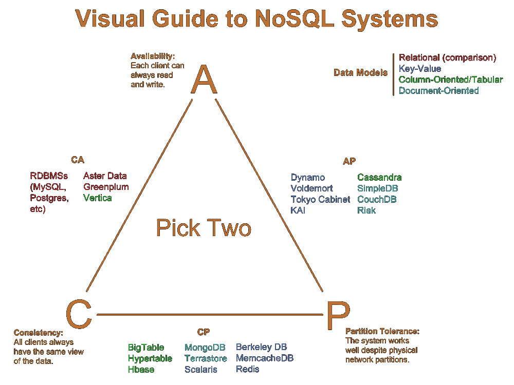

# Storage: NoSQL Database

## RDBMS
I Relational Data Base Management Systems (RDBMS) sono i sistemi tradizionali di data storage relazionale.

I vantaggi principali sono:

* garanzia ACID
* linguaggio SQL
* data model relazionale (tabelle, righe, colonne) molto intuitivo
* schemi relazionali modificabili senza downtime
* supporto per applicazioni OLTP (OnLine Transaction Processing)
* tecnologia stabile e standardizzata

Gli svantaggi principali sono:

* non scalabili orizzontalmente
* necessaria conoscenza completa del DB per formulare query
* difficile definire strutture dati complesse
* limiti sulla dimensione dei campi
* supporto limitato a data integration tra DBMS diversi
* tecnologie proprietarie costose

Le moderne applicazioni web comportano:

* massive data
* spikes di traffico
* alto rate R/W
* modifiche ai data schema, supposti flesibili

Una possibile soluzione per gli RDBMS è di prevedere:

* *replicazione:* un'architettura master-slave in cui il Master regola la replicazione sugli Slave permetterebbe di scalare le Read, ma non le Write.
* *sharding:* il partizionamento orizzontale dei dati su più nodi (ad esempio, mediante consistent hashing) permetterebbe di scalare le Read e le Write, ma eliminerebbe le garanzie ACID.

Pertanto, scalare i RDBMS è costoso ed inefficiente.

---

## NoSQL Datastore
I datastore NoSQL (Not-Only-SQL) sono una classe di tecnologie di data storage che si propone come alternativa ai tradizionali RDBMS, per ovviare ai limiti di questi ultimi in termini di scalabilità orizzontale.

Il principio fondante di questi sistemi è *evitare complessità non strettamente necessarie, a favore delle performance*.

Le caratteristiche principali sono:

* **garanzia BASE**
* **scalabilità orizzontale, disponibilità, fault-tolerance** mediante *sharding* e *replicazione*
* **distribuzione geografica**
* **schemi flessibili**
* **query-language semplice**
* **API semplice**

I datastore NoSQL si differenziano anzitutto per il **data-model** adottato, che può essere:

* **aggregate-oriented:** i dati sono rappresentati come aggregati, ovvero strutture dati complesse (record con field semplici, array e record innestati) tali che vi è *garanzia ACID intra-aggregato*. I tipi di aggregato sono:

  * **key-value:** i dati sono rappresentati come una collezione di coppie chiave-valore, in cui il valore può essere a sua volta un aggregato (tra cui anche array e map), memorizzato come un *BLOB* con *struttura opaca* (non sono possibili query sul valore) e *accessibile solo mediante key-lookup*. Alcuni datastore supportano anche (i) ordinamento delle chiavi, (ii) store in-memory dei dati e (iii) query con full-text search sul contenuto del valore. I modelli di consistenza adottati sono: *consistenza finale* in sistemi AP e *consistenza linearizzabile* in sistemi CP.

  Gli esempi applicativi più diffusi sono: *caching, storing di informazioni di sessione e profili utente*.
  I datastore più diffusi sono: *DynamoDB, Redis, Memcached, Voldemort e LevelDB*.

  * **column-family:** i dati sono rappresentati come una collezione di coppie chiave-valore, in cui il valore è una *struttura flessibile e visibile* di colonne organizzate in *column-family*. Una colonna è una collezione di attributi dello stesso tipo. Una column-family è una collezione di colonne spesso accedute contemporaneamente.

  Le caratteristiche principali sono:

  * struttura visibile: sono possibili query sulle colonne.
  * schemi flessibili: ogni riga può avere colonne diverse.
  * i dati sono memorizzati column-oriented: le colonne sono memorizzate in settori contigui del disco per minimizzare la latenza di I/O.
  * i dati sono navigati sia column-oriented che row-oriented.
  * colonne organizzate in column-family per raggruppare le colonne frequentemente accedute insieme
  * sharding di righe e colonne

  Gli esempi applicativi più diffusi sono: *applicazioni data-intensive read-mostly in cui le query riguardano operazioni su poche colonne*.
  I datastore più diffusi sono: *BigTable, HBase, Cassandra*.

  * **document:** i dati sono rappresentati come una collezione di coppie chiave-documento, in cui il documento è un *aggregato complesso, struttura flessibile e visibile* .

  Le caratteristiche principali sono:
    * struttura visibile: sono possibili query sui campi dell'aggregato.
    * schemi flessibili: ogni document può avere campi diversi.
    * codifica standard dei documenti (e.g. XML, JSON, YAML)
    * indexing dei dati basato sul contenuto dell'aggregato
    * operazione Update comporta sempre la sostituzione dell'intero documento e non solo la modifica di campi specifici
    * API CRUD uniformi, ma non standardizzate.

  Possiamo dunque dire che un document datastore
  (i) è simile ad un key-value datastore, avente però come valore un aggregato con struttura visibile;
  (ii) è simile ad un column-family datastore, avente però come valore un aggregato con schemi più flessibili.

  Gli esempi applicativi più diffusi sono: *applicazioni data-intensive operanti su dati semi-strutturati e sparsi*.
  I datastore più diffusi sono: *MongoDB, CouchDB, Couchbase e RavenDB*.

* **graph-oriented:** i dati sono rappresentati come un grafo, in cui
(i) i nodi sono caratterizzati da un ID e da una collezione di coppie chiave-valore e
(ii) gli archi sono indiretti o diretti e caratterizzati da una collezione di coppie chiave-valore.
Questi datastore tendono a fornire garanzie ACID.
Di contro, *la scalabilità orizzontale è difficoltosa*, in quanto è difficile partizionare dati fortemente correlati ed attraversare una struttura partizionata su più nodi.

Gli esempi applicativi più diffusi sono: *applicazioni di social networks analysis* e *pattern recognition*.
I datastore più diffusi sono: *Neo4j, OrientDB, InfiniteGraph e HyperGraphDB*.

## Performance
Non è stato ancora stabilito un benchmark standard per la valutazione delle performance dei NoSQL datastore.
Un primo tentativo è **Yahoo! Cloud Serving Benchmark (YCSB)**, ovvero un generatore di workload open-source.
In ogni caso, datastore distinti rispondono a requisiti distinti, pertanto non è possibile individuare una soluzione unica per tutti i casi.

## Persistenza poliglotta
Con il termine **persistenza poliglotta** si indica uno strato di data storage implementato da DB e datastore differenti.
Ogni classe di datastore è infatti progettata per rispondere a requisiti diversi.
In particolare, tecnologie diverse rispondono diversamente al **trade-off CAP**.

Pertanto, sistemi in cui il data storage è implemetato da una singola tecnologia possono risultare inefficienti.

Ad esempio, un'applicazione di e-commerce può implementare lo strato di data storage nel seguente modo:

* gestione dello shopping cart e della sessione utente basata su key-value datastore;
* gestione degli ordini basata su document datastore;
* gestione dell'inventario basata su RDBMS;
* gestione delle relazioni tra utenti basata su graph datastore.

---

## DynamoDB
DynamoDB è un *datastore key-value* sviluppato da Amazon, noto per la sua *alta scalabilità, alta disponibilità e garanzie SLA stringenti*.

È disponibile come servizio Amazon Web Services (AWS) ed è utilizzato per implementare lo strato di persistenza in altri servizi AWS (e.g. EMR).

Le caratteristiche principali sono:

* **sistema AP**

* **architettura  P2P** con **membership gossip-based**

* **sharding basato su consistent hashing:**
  * ogni nodo fisico può rappresentare più nodi logici dell'anello.
  * distribuzione del carico in funzione delle risorse del nodo fisico.
  * grado di replicazione configurabile.

* **alta disponibilità:**
  * i conflitti non sono prevenuti, ma risolti dall'applicazione o datastore (last-write wins) *durante operazioni Read*.
  * **sloppy-quorum:** se il quorum su operazioni R/W non può essere raggiunto a causa del partizionamento della rete, si creano delle *repliche transitorie* con le quali si raggiunge il quorum.
  * **hinted handoff**: se una put deve scrivere su un nodo temporanemente non disponibile, la richiesta viene reindirizzata ad un altro nodo, il quale è responsabile di rigirarla al nodo originario una volta ristabilità la disponibilità.
  * **passive failure-detection:** vengono ignorati i fallimenti di nodi non coinvolti in richieste dell'utente.

* **bassa sicurezza:** assume di essere eseguito in un ambiente non ostile in quanto usato internamente.

* **data versioning:**
  * ad ogni dato è associato un *version number*.
  * la risoluzione dei conflitti è lasciata al client.

* **API molto semplice:**
  * metodi get/put applicabili ad un'unica entità alla volta.
  * metodi get/put usati anche per risolvere conflitti (se ci sono versioni in conflitto, la get ritorna una lista di valori con version number).

Un datastore molto simile a DynamoDB è *RiakKV*, il quale prevede però anche il supporto per Mesos.

---

## Redis
REmote DIrectory Server (Redis) è un *datastore key-value in-memory* spesso utilizzato per implementare lo *strato di caching*.

Fino al 2015 è stato il più famoso della sua categoria.

Le caratteristiche principali sono:

* **in-memory storage:** le gestione in-memory dei dati garantisce una efficienza altissima.

* **atomicità:** molte operazioni sono atomiche.

* **aggregato:**
* la chiave è una stringa ASCII a cui è possibile associare un timeout di validità.
* il valore è una stringa (al più 512MB) o (ii) un contenitore di stringhe (hashmap, list, set, sortedset).

---

## BigTable
BigTable è un *datastore column-family* sviluppato da Google.

È disponibile come servizio di *Google Cloud Platform* ed è utilizzato in molte applicazioni di Google (e.g. Web indexing, Maps, YouTube).

Le caratteristiche principali sono:

* **sistema CP, autonomico, fault-tolerant**

* **architettura master-slave:**
  * **Master Server (MS):** unico, gestisce il mapping Tablet/TabletServer, gestisce schemi e metadati, esegue load balancing e garbage collection.
  * **Tablet Server (TS):** gestisce  tipicamente 1000 Tablet, Read/Write delle proprie Tablet, sharding delle proprie Tablet.
  * **Client Library (CL):** interagisce con MS per avere i metadati necessari ad interagire con i TS; comunica direttamente con TS per operazioni R/W; caching delle posizioni delle Tablet.
  * **Chubby:** utilizzato per:
    * garantire unicità del master.
    * garantire atomicità delle operazioni R/W.
    * mantenimento della *ServerDirectory*, contenente gli indirizzi dei TS.
    * mantenimento della *RootTable*, contenente le locazioni delle Tablet della *MetadataTable*, contenente le locazioni delle Tablet.
    * gestione delle informazioni sugli schemi.

* **disaccoppiamento control/data plane:** il Client interagisce con il Master per conoscere la locazione delle Tablet; il Client interagisce con i Tablet Server per leggere i file SSTable.

* **persistenza/replicazione GFS:** raw storage su GFS e replicazione gestita da GFS.

* **sharding:**
  * le righe sono partizionate in **Tablet** (righe contigue), partizionate in **Chunk**.
  * i chunk sono in **formato SSTable**: un file SSTable è composto da una collezione di *blocchi (64KB)* e un *Index* per individuare un blocco specifico all'interno del file
  * righe appartenenti ad uno stesso Tablet sono memorizzate insieme.
  * ogni Tablet è servita da un solo TS.
  * **auto-sharding** di Tablet troppo grandi.

* **indexing ottimizzato** mediante il partizionamento in *column-family*.

* **data versioning:** ogni cella può avere più versioni di uno stesso valore, ad ognuno dei quali è associato un *timestamp*.

* **atomicità:** l'atomicità è garantita sulla singola riga.

### Focus: fasi principali
* **Master startup:**
  * il Master acquisisce il *MasterLock* da Chubby, assicurandosi così di essere l'unico Master attivo.
  * il Master registra i server indicati nella *Servers Directory* di Chubby.
  * il Master richiede ad ogni Tablet Server l'elenco delle Table gestite.
  * il Master consulta la *Metadata Table* per scoprire quali Tablet non sono state ancora assegnate ad un Tablet Server.

* **Tablet Assignment:**
  * il Master consulta i *Server Lock* di Chubby per scoprire quali siano i Tablet Server attivi.
  * il Master assegna la Tablet scoperte al primo Tablet Server disponibile.
  * il Master riassegna Tablet servite da Tablet Server non disponibili al primo Tablet Server disponibile.

* **Tablet Discovery:** Chubby mantiene la *Root Tablet*, nella quale sono indicate le locazioni delle Tablet della MetadataTable, contenente le locazioni di tutte le Tablet.

* **Tablet Serving:** le operazioni Write sono dapprima memorizzate in una struttura in-memory, detta **memtable**, per poi essere rese persistenti all'interno dei file *SSTable*.

* **Tablet Loading:** il Master determina la locazione della Tablet; il Client legge le SSTable dai TS.

---

## HBase
Apache HBase è un *datastore column-family* open-source sviluppato come *clone di BigTable* (stesso data-model, architettura e sharding).

È utilizzato sia per applicazioni batch che per applicazioni real-time.

Le caratteristiche principali sono:

* **sistema CP**

* **architettura master-slave:**
  * **MasterServer (MS):** gestione mapping region->RegionServer.
  * **RegionServer (RS):** gestiscono la persistenza sul proprio nodo. Possono essere aggiunti/rimossi a runtime per un migliore load-balancing.
  * coordinazione mediante *Zookeeper*.

* **basato su HDFS**

* **sharding:**
  * le righe sono organizzate in **Region** (righe contigue), ognuna della quali è assegnata ad un RegionServer.
  * **auto-sharding** di Region troppo grandi.

* **data versioning:** ogni cella può contenere più versioni dello stesso valore, ad ognuna delle quali è associato un *timestamp*.

* **I/O:**
  * *consistenza forte su riga*, in quanto ogni riga è servita da un unico RegionServer.
  * *lookup molto efficiente*.

---

## Cassandra
Cassandra è un *datastore column-family* sviluppato da Facebook, noto per la sua *alta scalabilità orizzontale, alta disponibilità, bassa latenza e distribuzione geografica*.

È stato sviluppato con l'intenzione di fondere i punti di forza di *Amazon DynamoDB* e *Google BigTable*.

Le caratteristiche principali sono:

* **sistema AP**

* **architettura master-less** per minimizzare la latenza delle operazioni.

* **consistenza configurabile** è possibile stabilire il grado di consistenza per ogni query, specificando il *tipo di quorum* richiesto:
  * **ONE:** una sola replica.
  * **QUORUM:** la maggioranza delle repliche.
  * **ALL:** tutte le repliche.
  * **LOCAL_QUORUM:** tutte le repliche dello stesso datacenter.

* **Cassandra Query Language (CQL)** come query language *SQL-like*.

---

## MongoDB
MongoDB è un *datastore document* considerato ad oggi un de-facto standard della sua categoria.

Le caratteristiche principali sono:

* **document:**
  * i document sono rappresentati in formato **BSON**, ovvero un'estensione di JSON in formato binario con supporto a più tipi di dato (e.g. timestamp, objectID).
  * ogni document è identificato da un **documentID** univoco da utilizzare per fare collegamenti tra document.
  * i document sono raccolti in **collection**.

* **query language semplice e flessibile:**
  * *filtraggio* per selezione document molto semplice.
  * *dot-notation* per indicizzazione di array e esplorazione attributi (e.g, array.2, document.attribute).
  * una query ritorna un *cursor* per scorrere i document risultanti.

---

## Neo4j
Neo4j è un *datastore graph* considerato ad oggi un de-facto standard della sua categoria.

Le caratteristiche principali sono:

* **garanzia ACID**

* **architettura master-slave:** il master esegue operazioni R/W e gli slave eseguono operazioni Read-Only.

* **multi-level caching** per aumentare il throughput.

* **query language:** fornisce **Cypher** come query language *SQL-like* avente anche primitive built-in per eseguire query sui path (e.g. shortestPath, allShortestPath).

* **label:** nodi e archi taggabili con uno o più *label* per distinguerne il ruolo nel dominio.

